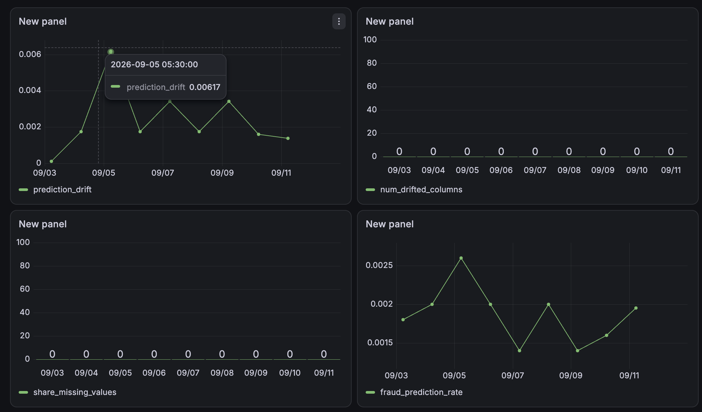

# Credit Card Fraud Detection MLOps Pipeline

An end-to-end MLOps pipeline for detecting fraudulent credit card transactions, covering model development, experiment tracking, workflow orchestration, deployment, monitoring, and testing.

## Tech Stack

- **Programming:** Python
- **Machine Learning:** Scikit-learn, Imbalanced-learn
- **Hyperparameter Optimization:** Optuna
- **Experiment Tracking & Model Registry:** MLflow
- **Workflow Orchestration:** Prefect
- **API Deployment:** Flask
- **Containerization:** Docker
- **Monitoring:** Evidently, PostgreSQL, Grafana
- **Testing:** Pytest
- **Environment Management:** uv

---

# Project Architecture

```
                 Data
                  |
                  v
          Data Processing
                  |
                  v
     Feature Engineering Pipeline
                  |
                  v
    Model Training & Optimization
                  |
                  v
             MLflow
      (Tracking + Registry)
                  |
                  v
        Champion Model
                  |
                  v
          Flask API
                  |
                  v
        Docker Container
                  |
                  v
          Predictions
                  |
                  v
    Evidently Monitoring Pipeline
                  |
                  v
       PostgreSQL + Grafana
```

---

# Machine Learning Workflow

## Data Preparation

- Removed duplicate records.
- Split data into:
  - Training set
  - Validation set
  - Test set

- Maintained class distribution using stratified splitting due to severe fraud class imbalance.

---

## Feature Engineering

Implemented preprocessing using Scikit-learn pipelines:

- Log transformation of transaction amount.
- Robust scaling for:
  - Amount
  - Time
  - PCA-transformed features (V1-V28)

The preprocessing pipeline was packaged together with the model to ensure consistent training and inference behavior.

---

# Model Development

Multiple classification approaches were evaluated:

- Logistic Regression
- Decision Tree
- Random Forest

To handle class imbalance, the following techniques were evaluated:

- Random Undersampling
- Random Oversampling
- SMOTE

Hyperparameter optimization was performed using **Optuna**.

Model experiments were tracked using **MLflow**.

Tracked information includes:

- Model type
- Sampling strategy
- Hyperparameters
- PR-AUC
- Precision
- Recall
- F1-score
- Accuracy

---

# MLflow Model Management

The best-performing model was registered in MLflow Model Registry.

Workflow:

```
Training Run
      |
      v
MLflow Experiment Tracking
      |
      v
Model Registration
      |
      v
Champion Model Alias
```

The Champion model is loaded for deployment and future retraining workflows.

---

# Workflow Orchestration

Retraining workflow was automated using **Prefect**.

Pipeline stages:

```
Data Loading
      |
Data Splitting
      |
Model Retraining
      |
Evaluation
      |
MLflow Logging
      |
Model Registration
      |
Champion Promotion
```

---

# Model Deployment

The selected model was deployed as a REST API using Flask.

## API Endpoint

### Prediction

```
POST /predict
```

Example request:

```json
{
  "Time":154309.0,
  "V1":-0.0829,
  "Amount":1096.99
}
```

Response:

```json
{
  "fraud":0,
  "probability_of_fraud":0.002
}
```

---

### Health Check

```
GET /health
```

Response:

```json
{
  "response_status":200
}
```

---

# Containerization

The prediction service is packaged using Docker.

Build image:

```bash
docker build -t fraud-prediction-service .
```

Run container:

```bash
docker run -p 9696:9696 fraud-prediction-service
```

The API is available at:

```
http://localhost:9696
```

---

# Model Monitoring

Monitoring was implemented using **Evidently**, **PostgreSQL**, and **Grafana**.

The monitoring pipeline compares:

- Reference data: Validation dataset
- Current data: Incoming production-like transactions

Tracked metrics:

1. Prediction drift
2. Dataset drift
3. Missing value percentage
4. Fraud prediction rate
5. Average fraud probability

Architecture:

```
Prediction Data
       |
       v
Evidently
       |
       v
PostgreSQL
       |
       v
Grafana Dashboard
```

---

# Testing

## Unit Tests

Implemented using Pytest.

Covered:

- Input schema validation
- Feature preprocessing validation
- Model prediction output
- Prediction probability validation

Example:

```bash
pytest tests/unit_tests
```

---

## Integration Tests

Integration tests validate the deployed API workflow.

Flow:

```
Test Client
     |
     v
Flask API Container
     |
     v
ML Model
     |
     v
Prediction Response
```

Covered:

- API availability
- Prediction endpoint response
- Health endpoint validation
- Prediction output validation

Run:

```bash
./tests/integration_tests/run.sh
```

---

# Project Structure

```
fraud-detection/

├── model-building/
│   ├── training pipeline
│   └── Prefect workflows
│
├── deployment/
│   ├── Flask API
│   ├── Dockerfile
│   └── model artifact
│
├── monitoring/
│   ├── Evidently pipeline
│   ├── PostgreSQL setup
│   └── Grafana dashboards
│
├── tests/
│   ├── unit_tests/
│   └── integration_tests/
│
├── notebooks/
│
├── pyproject.toml
└── README.md
```

---

# Running the Project

## Install Dependencies

Using uv:

```bash
uv sync
```

---

## Start MLflow

```bash
mlflow server \
--backend-store-uri sqlite:///mlflow.db \
--default-artifact-root ./artifacts
```

---

## Run Training Pipeline

```bash
uv run python model-building/train.py
```

---

## Start Prediction API

```bash
docker run -p 9696:9696 fraud-prediction-service
```

---

## Run Tests

Unit tests:

```bash
uv run pytest tests/unit_tests
```

Integration tests:

```bash
./tests/integration_tests/run.sh
```

---

# Future Improvements

- Add GitHub Actions CI/CD pipeline.
- Store MLflow artifacts using cloud object storage.
- Automate model retraining based on drift thresholds.
- Add automated deployment workflow.
- Deploy using Kubernetes.

